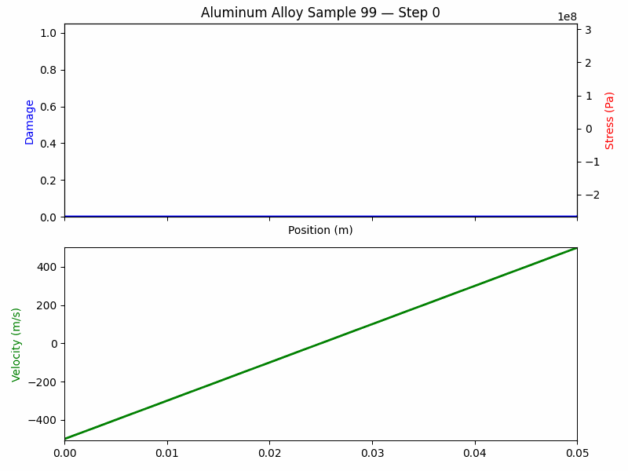
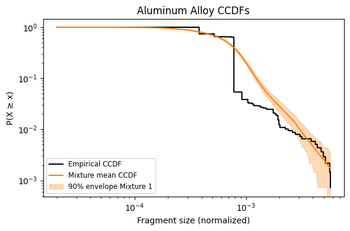
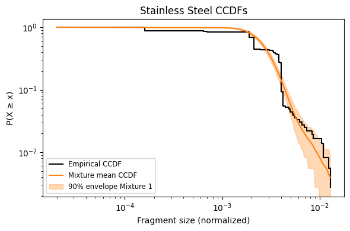
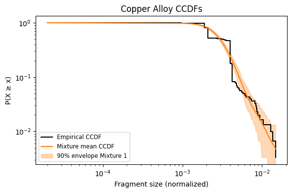
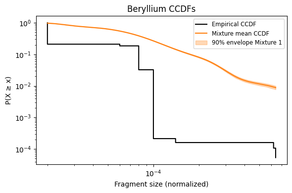
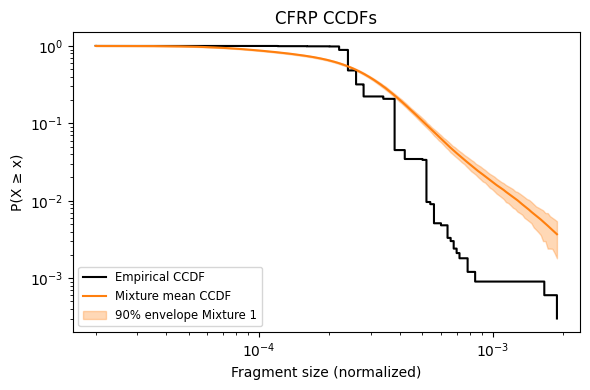
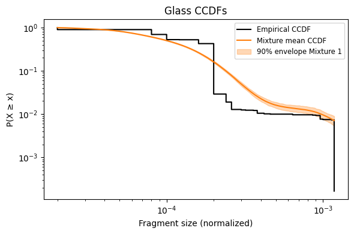
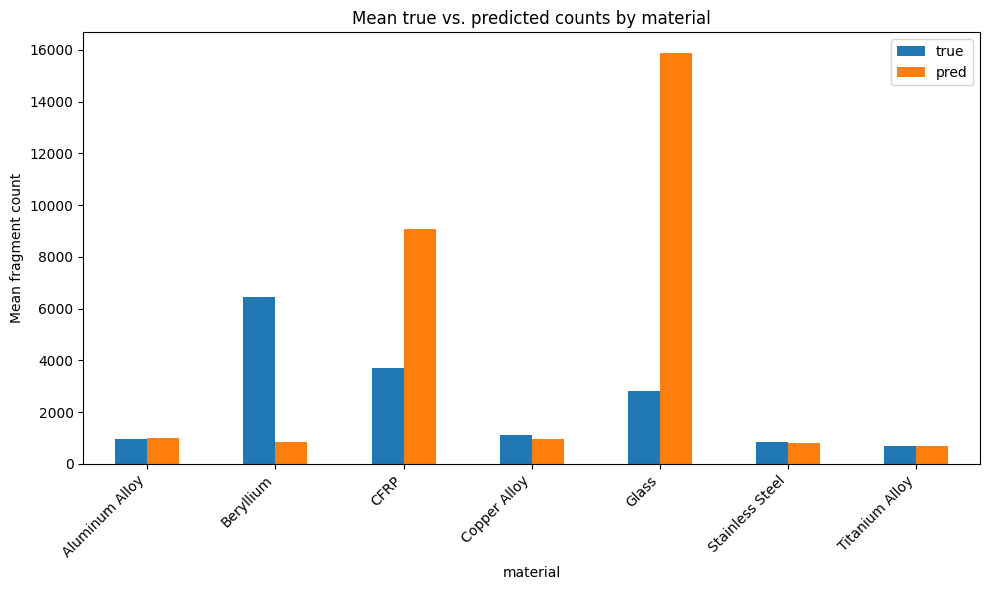

# 1.121 Project - Fracture Prediction via Mixture Density Networks

## Author: Tory Smith

## Date: 2025-05-12


This repository implements Mixture Density Network (MDN) architecture amd a U-NET MDN architecture for predicting fragment-size distributions from nondimensional input parameters. 

* Please see the attached presentation for additional details on the project including the motivation, methods, conclusions and impact.

# Data Generation Pipeline

Data was generated using a 1D cohesive-zone fracture solver, which simulates the fragmentation of a material under dynamic loading conditions. The simulation is based on the work of:

F. Zhou, J.-F. Molinari, and K. T. Ramesh, “A cohesive model based fragmentation analysis: effects of strain rate and initial defects distribution,” International Journal of Solids and Structures, vol. 42, no. 18–19, pp. 5181–5207, Sep. 2005, doi: 10.1016/j.ijsolstr.2005.02.009.




* **`Fragmentation_2.py`**: Implements a 1D cohesive-zone fracture solver that returns the time-evolution of stress, velocity, damage, and crack opening displacement (COD), and computes fragment-size distributions.
* **`1_D_MonteCarlo_2.py`**: Samples material parameters and strain rates, runs the fracture solver repeatedly, aggregates results, and saves them to pickled files.

---

```mermaid
flowchart LR
    A[Materials Dictionary] --> B[Sample Parameters]
    subgraph MonteCarlo Loop
        B --> C{For each Strain Rate}\n        C -->|rate in range| D{For each Material}\n        D --> E[Uniformly sample E, Gc, strength, density (N_sim draws)]
        E --> F[run_1D_simulation_time(...) from Fragmentation_2.py]
        F --> G[Collect outputs:
- time snapshots  
- stress arrays  
- velocity arrays  
- damage arrays  
- COD_MAX arrays]
        F --> H[Extract fragment metrics:
- frag_sizes  
- num_frag  
- avg_frag_size]
        G & H --> I[Store into `global_results[strain_rate][material]`]
    end
    I --> J[Save `global_results` to pickle per strain rate]
```

---

## Fragmentation Solver (`Fragmentation_2.py`)

1. **Spatial setup**

   * Domain length $L$, nodes $N$, spacing $\Delta x$
   * Material density $\rho$, wave speed $c=\sqrt{E/\rho}$, time step $\Delta t=\Delta x/c$
2. **Fields initialization**

   * Stress: $0.99\times strength_{base}$
   * Damage, COD, COD\_MAX: zeros
   * Velocity: linear far-field loading based on `strain_rate`
3. **Time-stepping loop**

   * Update interior and boundary nodes via finite-difference + cohesive-zone rules
   * Compute crack opening (COD) where stress exceeds strength
   * Update damage field $D=COD/COD\_fail$ (clamped to \[0,1])
   * Save snapshots of $stress, velocity, damage, COD\_MAX$ at `save_interval`
   * Terminate when damage converges or `max_steps` reached
4. **Post-processing**

   * Identify break indices $Damage\ge1$
   * Compute fragment sizes via spacings between breaks
   * Compute `num_frag` and `avg_frag_size`

Returns a dictionary with keys:

```python
{
  'X', 'time', 'stress', 'velocity', 'damage', 'COD_MAX',
  'frag_sizes', 'num_frag', 'avg_frag_size'
}
```

---

## Monte Carlo Driver (`1_D_MonteCarlo_2.py`)

1. **Define**:

   * List of `strain_rates` (e.g., 1e6 to 1e7 s⁻¹)
   * Material parameter ranges for E, Gc, strength, density
   * Number of samples `N_sim` per material
2. **Loop** over `strain_rates` and each `material`:

   * **Sample** `N_sim` values for each property uniformly within its range
   * **For each sample**:

     * Call `run_1D_simulation_time(...)`
     * Append full-field arrays to lists
     * Store aggregated metrics (`num_frag`, `avg_frag_size`)
   * **Save** results under `global_results[strain_rate][material]`
   * **Dump** `global_results[strain_rate]` to `global_sensitivity_results_<rate>.pkl`

---

All generated pickles contain:

```python
{
  'E_samples': np.ndarray(N_sim),
  'Gc_samples': np.ndarray,
  'strength_samples': np.ndarray,
  'density_samples': np.ndarray,
  'num_frag': np.ndarray(N_sim),
  'avg_frag': np.ndarray(N_sim),
  'time': list of np.ndarray,
  'stress': list of np.ndarray,
  'velocity': list of np.ndarray,
  'damage': list of np.ndarray,
  'COD_MAX': list of np.ndarray,
  'frag_sizes': list of np.ndarray,
  'strain_rate': float
}
```

Use these pickles as inputs to the MDN training pipelines.


# MDN\_Fracture: Fragment-Size Prediction via Mixture Density Networks


* **Dataset**: `MultiFileFragmentDataset` for extracting fragment lengths and counts.
* **Models**:

  * `FragmentMDN`: mixture of LogNormal components

* **Losses**:

  * Negative log-likelihood (NLL)
  * Mass-conservation loss
  * Tail-exponent (power-law) loss

---

## Architecture Overview

```mermaid
flowchart TD
    subgraph Data
        A[HDF5 Files] --> B[MultiFileFragmentDataset]
        B --> C[p: (B,5)]
        B --> D[frag_sizes: list of N_i]
        B --> E[N_frags: (B,)]
        B --> F[V_tot: (B,)]
    end
    subgraph Model
        C --> G[Shared MLP backbone]
        G --> H1[Linear → logits α (B,K)]
        G --> H2[Linear → means μ (B,K)]
        G --> H3[Linear → log-σ (B,K)]
        H1 --> I1[Categorical(logits=α) → π]
        H2 --> I2[μ]
        H3 --> I3[softplus(log-σ) → σ]
        I1 & I2 & I3 --> J[MixtureSameFamily(LogNormal)]
    end
    subgraph Losses
        J --> L1[NLL Loss]
        J --> L2[Mass-Conservation Loss]
        J --> L3[Tail-Exponent Loss]
        L1 & L2 & L3 --> M[Total Loss]
    end
```

---

## Loss Functions

Let:

* $B$: batch size
* $K$: number of mixture components
* $N_i$: number of fragments in sample $i$
* $s_{ij}$: true fragment size $j$ in sample $i$
* $\alpha_{ik},\mu_{ik},\sigma_{ik}$: logits, means, and scales for component $k$ of sample $i$

### 1. Negative Log-Likelihood (NLL)

Mixture density for sample $i$:

$$
\pi_{ik} = \frac{e^{\alpha_{ik}}}{\sum_{m=1}^K e^{\alpha_{im}}},
\quad
p_i(s) = \sum_{k=1}^K \pi_{ik}\,\mathrm{LogNormal}(s\mid \mu_{ik},\sigma_{ik}).
$$

Batch-averaged NLL:

$$
\mathcal{L}_{\mathrm{NLL}}
= -\frac{1}{\sum_i N_i}\sum_{i=1}^B \sum_{j=1}^{N_i} \log p_i\bigl(s_{ij}\bigr).
$$

### 2. Mass-Conservation Loss

Expected fragment size for sample $i$:

$$
\mathbb{E}[s]_i = \sum_{k=1}^K \pi_{ik}\exp\bigl(\mu_{ik} + \tfrac12 \sigma_{ik}^2\bigr).
$$

Total predicted volume: $V_i = N_i\,\mathbb{E}[s]_i$ (target $V_i^{\mathrm{true}}=1$).

$$
\mathcal{L}_{\mathrm{mass}}
= \frac{1}{B}\sum_{i=1}^B \bigl(V_i - 1\bigr)^2.
$$

### 3. Tail-Exponent (Power-Law) Loss

Define a tail evaluation point $x_{\mathrm{tail}}$.  Approximate the exponent:

$$
\tau_{i}^{\mathrm{pred}}
\approx -\frac{\log p_i(x_{\mathrm{tail}}\times 1.1)
- \log p_i(x_{\mathrm{tail}})}{\log(1.1)}.
$$

Loss against physical exponent $\tau_{\mathrm{phys}}$:

$$
\mathcal{L}_{\mathrm{tail}}
= \frac{1}{B}\sum_{i=1}^B \bigl(\tau_{i}^{\mathrm{pred}} - \tau_{\mathrm{phys}}\bigr)^2.
$$

### 4. Total Objective

Combine with weights $\lambda_{\mathrm{mass}},\lambda_{\mathrm{tail}}$:

$$
\boxed{
\mathcal{L} = \mathcal{L}_{\mathrm{NLL}}
+ \lambda_{\mathrm{mass}}\,\mathcal{L}_{\mathrm{mass}}
+ \lambda_{\mathrm{tail}}\,\mathcal{L}_{\mathrm{tail}}.
}
$$


# UNet‑MDN Fracture Architecture

1D U‑Net architecture with a Mixture Density Network (MDN) head to predict fragment size distributions alongside deterministic fields (damage, stress, velocity) governed by physics‑informed losses.

---

## Architecture Overview

```mermaid
flowchart LR
    A[Input \(p, x, t\)] --> B[Concatenate to \((B, in\_ch, N)\)]
    B --> C[UNet1d Encoder–Decoder]
    C --> D[Feature Map \((B, base\_width, N)\)]
    D --> E[Deterministic Head (1×1 Conv)]
    E --> F[Outputs \(D\_logit, S, v\)]
    D --> G[MDN Head]
    G --> H[AdaptiveAvgPool1d → Flatten]
    H --> I[Linear → \((logits, \mu s, \log\sigma s)\)]
    I --> J[Clamp & Softplus]
    J --> K[MixtureSameFamily]
    K --> L[Probabilistic Fragment Distribution]
```

* **UNet1d**: produces two outputs: 1) `unet_out` (shape $(B,3,N)$) for deterministic fields; 2) `feat` (shape $(B, base_width, N)$) for MDN.
* **Deterministic Head**: a 1×1 convolution mapping `feat` → $(D\_logit, S, v)$.
* **MDN Head**: adaptive pooling + flatten + linear → mixture logits, means $\mu$, and log‑scales $\log\sigma$. Clamping and softplus yield valid scales, then form a `MixtureSameFamily` of LogNormals.

---

## Loss Functions

Let:

* $B$: batch size
* $N$: number of spatial points per sample
* $K$: number of mixture components
* $s_j$: observed fragment sizes (over all samples, total $S$ fragments)
* $\ell_{ik}, \mu_{ik}, \sigma_{ik}$: logits, means, and scales for sample $i$, component $k$
* $D(t,x), S(t,x), v(t,x)$: network outputs at time $t$ and position $x$
* Hyperparameters: $\beta, \lambda_{phys}, \lambda_{mass}$

### 1. MDN Negative Log‑Likelihood

Mixture density:

$$
p(s_j) = \sum_{k=1}^K \pi_{ik}\,\mathrm{LogNormal}\bigl(s_j\mid \mu_{ik},\sigma_{ik}\bigr),
\;\pi_{ik}=\frac{e^{\ell_{ik}}}{\sum_{m=1}^K e^{\ell_{im}}}
$$

Loss:

$$
\mathcal{L}_{MDN} = -\frac{1}{S}\sum_{j=1}^{S} \log p(s_j).
$$

### 2. Physics‑Informed Residuals

Define residuals at $t=1$:

$$
\begin{aligned}
r_{mom}(i,j) &= \frac{\partial v}{\partial t}\big|_{t=1,x_j} - \frac{\partial S}{\partial x}\big|_{t=1,x_j},\\
r_{dam}(i,j) &= \frac{\partial D}{\partial t}\big|_{t=1,x_j} - \bigl[1 - D(1,x_j)\bigr] \, \frac{\partial v}{\partial x}\big|_{t=1,x_j}.
\end{aligned}
$$

Averaged losses:

$$
\mathcal{L}_{mom} = \frac{1}{B N} \sum_{i,j} r_{mom}(i,j)^2,
\quad
\mathcal{L}_{dam} = \frac{1}{B N} \sum_{i,j} r_{dam}(i,j)^2,
\quad
\mathcal{L}_{phys} = \mathcal{L}_{mom} + \mathcal{L}_{dam}.
$$

### 3. Initial‑Condition Loss

At $t=0$, enforce:
$D=0,\; S=0.99,\; v=x-0.5$

$$
\mathcal{L}_{IC} = \frac{1}{B N} \sum_{i,j} \Bigl[D(0,x_j)^2 + (S(0,x_j)-0.99)^2 + (v(0,x_j)-(x_j-0.5))^2\Bigr].
$$

### 4. Boundary‑Condition Loss

At $t=1$, enforce:
$v(1,0)=-0.5,\; v(1,1)=+0.5$

$$
\mathcal{L}_{BC} = \frac{1}{B} \sum_{i=1}^B \Bigl[(v_i(1,0)+0.5)^2 + (v_i(1,1)-0.5)^2\Bigr].
$$

### 5. Mass‑Conservation Loss

Expected fragment size per sample:

$$
E[s]_i = \sum_{k=1}^K \pi_{ik}\,e^{\mu_{ik} + \tfrac12\sigma_{ik}^2}.
$$

Total predicted mass:
$V_i = E[s]_i \times N_i$, (should equal 1). Loss:

$$
\mathcal{L}_{mass} = \frac{1}{B}\sum_{i=1}^B (V_i - 1)^2.
$$

### 6. Total Objective

$$
\boxed{
\mathcal{L} = \beta\,\mathcal{L}_{MDN} + \lambda_{phys}\bigl(\mathcal{L}_{phys} + \mathcal{L}_{IC} + \mathcal{L}_{BC}\bigr)
+ \lambda_{mass}\,\mathcal{L}_{mass}.
}
$$

## Results

### 1. MDN Fragment Size Prediction

The MDN model was trained on the generated data, and the predicted fragment size distributions were compared to the true distributions. The model was able to accurately capture the shape and scale of the the ductile distributions, as shown in the following figures:




However, the model struggled to predict the brittle and polymer distributions, as shown in the following figures:




This result is also reflected when looking at the total number of fragments predicted by the model. The model was able to accurately predict the number of fragments for the ductile materials, but struggled with the brittle and polymer materials. The following figure shows the mean predicted number of fragments compared to the true number of fragments:



### 2. U-Net MDN Fragment Size Prediction
I wasn't able to finish training the U-Net to evaluate its performance before the deadline. 


### Acknowledgement 

ChatGPT and GitHub Copilot were used to assist in the development of this code, research, and writing of this README.